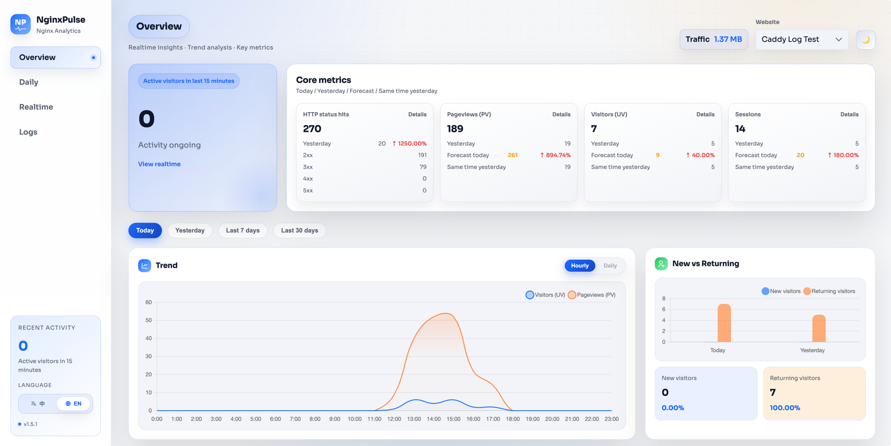

<p align="center">
  
</p>

<p align="center">
  English | <a href="README.md">简体中文</a>
</p>

# NginxPulse

Lightweight Nginx access log analytics and visualization dashboard with realtime stats, PV filtering, IP geo lookup, and client parsing.




## Table of Contents
- [Tech Stack](#tech-stack)
- [IP Geo Lookup Strategy](#ip-geo-lookup-strategy)
- [How to Use](#how-to-use)
  - [1) Docker](#1-docker)
  - [2) Docker Compose](#2-docker-compose)
  - [3) Manual Build (Frontend + Backend)](#3-manual-build-frontend--backend)
  - [4) Single Binary Deployment](#4-single-binary-deployment)
  - [5) Makefile Commands](#5-makefile-commands)
- [Mount Multiple Log Files](#mount-multiple-log-files)
- [Custom Log Format](#custom-log-format)
- [Caddy Log Support](#caddy-log-support)
- [Access Keys (ACCESS_KEYS)](#access-keys-access_keys)
- [Notes for Development](#notes-for-development)
- [Directory Structure](#directory-structure)

## Tech Stack
- **Backend**: `Go 1.23.x` · `Gin` · `Logrus`
- **Data**: `SQLite (modernc.org/sqlite)`
- **IP Geo**: `ip2region` (local) + `ip-api.com` (remote batch)
- **Frontend**: `Vue 3` · `Vite` · `TypeScript` · `PrimeVue` · `ECharts/Chart.js` · `Scss`
- **Container**: `Docker / Docker Compose` · `Nginx` (static frontend)

## IP Geo Lookup Strategy
1. **Fast filter**: empty/local/loopback returns “local”, intranet returns “intranet/local network”.
2. **Cache first**: in-memory cache hit returns directly (up to 50,000 entries).
3. **Remote first**: call `ip-api.com/batch` (timeout 1.2s, max 100 IPs per batch).
4. **Local fallback**: if remote fails or returns “unknown”, IPv4 falls back to local ip2region (50ms timeout).
5. **IPv6 handling**: only remote lookup; failure returns “unknown”.

> The local database `ip2region.xdb` is embedded in the binary. On first startup it is extracted to `./var/nginxpulse_data/ip2region.xdb` and vector indexes are loaded when possible.

> This project calls an external IP geo API (`ip-api.com`). Ensure outbound access is allowed.

## How to Use

### 1) Docker
Single image (frontend Nginx + backend service):

Use remote image (Docker Hub):

```bash
docker run -d --name nginxpulse \
  -p 8088:8088 \
  -p 8089:8089 \
  -e WEBSITES='[{"name":"Main","logPath":"/share/log/nginx/access.log","domains":["kaisir.cn","www.kaisir.cn"]}]' \
  -v ./nginx_data/logs/all/access.log:/share/log/nginx/access.log:ro \
  -v "$(pwd)/var/nginxpulse_data:/app/var/nginxpulse_data" \
  magiccoders/nginxpulse:latest
```

Build and run locally:

```bash
docker build -t nginxpulse:local .
docker run -d --name nginxpulse \
  -p 8088:8088 \
  -p 8089:8089 \
  -e WEBSITES='[{"name":"Main","logPath":"/share/log/nginx/access.log","domains":["kaisir.cn","www.kaisir.cn"]}]' \
  -v ./nginx_data/logs/all/access.log:/share/log/nginx/access.log:ro \
  -v "$(pwd)/var/nginxpulse_data:/app/var/nginxpulse_data" \
  nginxpulse:local
```

Multi-arch build and publish:

```bash
./scripts/publish_docker.sh -r <repo> -p linux/amd64,linux/arm64
```

Local build for a specific arch:

```bash
docker buildx build --platform linux/arm64 -t nginxpulse:local --load .
```

GitHub Actions release:
- Add these secrets:
  - `DOCKERHUB_USERNAME`
  - `DOCKERHUB_TOKEN`
  - `DOCKERHUB_REPO` (e.g. `username/nginxpulse`)
- Trigger by pushing `v*` tag or creating a release.

> If you prefer config file, mount `configs/nginxpulse_config.json` to `/app/configs/nginxpulse_config.json`.

### 2) Docker Compose
Use remote image (Docker Hub): replace `docker-compose.yml` with the remote image version and run:

```bash
docker compose up -d
```

Build from source: keep the repo `docker-compose.yml` and run:

```bash
docker compose up -d --build
```

Example `docker-compose.yml` (remote image):

```yml
version: "3.8"
services:
  nginxpulse:
    image: magiccoders/nginxpulse:latest
    container_name: nginxpulse
    ports:
      - "8088:8088"
      - "8089:8089"
    environment:
      WEBSITES: '[{"name":"Main","logPath":"/share/log/nginx/access.log","domains":["kaisir.cn","www.kaisir.cn"]}]'
    volumes:
      - ./nginx_data/logs/all/access.log:/share/log/nginx/access.log:ro
      - ./var/nginxpulse_data:/app/var/nginxpulse_data
      - /etc/localtime:/etc/localtime:ro
    restart: unless-stopped
```

Example `docker-compose.yml` (local build):

```yml
version: "3.8"
services:
  nginxpulse:
    image: nginxpulse:local
    build:
      context: .
    container_name: nginxpulse
    ports:
      - "8088:8088"
      - "8089:8089"
    environment:
      WEBSITES: '[{"name":"Main","logPath":"/share/log/nginx/access.log","domains":["kaisir.cn","www.kaisir.cn"]}]'
    volumes:
      - ./nginx_data/logs/all/access.log:/share/log/nginx/access.log:ro
      - ./var/nginxpulse_data:/app/var/nginxpulse_data
      - /etc/localtime:/etc/localtime:ro
    restart: unless-stopped
```

Notes:
- `logPath` must be the path inside the container.
- `var/nginxpulse_data` is for persistent DB and cache.

Environment variables:
- `WEBSITES` (required if no config file)
  - JSON array of websites: `name`, `logPath`, `domains` (optional).
  - `domains` is used to classify referers as “internal”.
- `CONFIG_JSON` (optional)
  - Full config JSON string (same as `configs/nginxpulse_config.json`).
  - If set, it overrides local config file; other env vars can still override fields.
- `LOG_DEST` (optional, default `file`)
  - Log output: `file` or `stdout`.
- `TASK_INTERVAL` (optional, default `1m`)
  - Scan interval, Go duration format like `5m`, `25s`.
- `LOG_RETENTION_DAYS` (optional, default `30`)
  - Database retention in days.
- `DEMO_MODE` (optional, default `false`)
  - Enable demo mode, generates mock logs and skips file parsing.
- `ACCESS_KEYS` (optional, default empty)
  - Access key list (JSON array or comma-separated).
- `APP_LANGUAGE` (optional, default `zh-CN`)
  - Default language (`zh-CN` / `en-US`, also accepts `zh`, `en`).
  - Also controls language for remote IP geo lookup.
- `SERVER_PORT` (optional, default `:8089`)
  - Service port, can be `:8089` or `8089`.
- `PV_STATUS_CODES` (optional, default `[200]`)
  - Status codes included for PV.
- `PV_EXCLUDE_PATTERNS` (optional, default built-in)
  - Regex list to exclude URLs.
- `PV_EXCLUDE_IPS` (optional, default empty or config file)
  - Excluded IPs (JSON array or comma-separated).

Access:
- Frontend: `http://localhost:8088`
- Backend: `http://localhost:8089`

Frontend language:
- Default language is from backend `APP_LANGUAGE` / config `system.language`.
- Override via URL: `?lang=en` or `?locale=en-US`.

> See [nginxpulse_config.json](configs/nginxpulse_config.json) for PV_EXCLUDE_PATTERNS and PV_EXCLUDE_IPS formats.

### 3) Manual Build (Frontend + Backend)
Frontend:

```bash
cd webapp
npm install
npm run build
```

Backend:

```bash
go mod download
go build -o bin/nginxpulse ./cmd/nginxpulse/main.go
```

Local dev (frontend + backend together):

```bash
./scripts/dev_local.sh
```

> Frontend dev server defaults to 8088 and proxies `/api` to `http://127.0.0.1:8089`.
> Prepare logs in `var/log/` (or ensure `configs/nginxpulse_config.json` points to the file).

### 4) Single Binary Deployment
To distribute a single binary (frontend bundled), use:

```bash
./scripts/build_single.sh
```

It produces a single executable (with frontend embedded). Start it to serve both frontend and backend:
- Frontend: `http://localhost:8088`
- Backend: `http://localhost:8088/api/...`

By default it builds `linux/amd64` and `linux/arm64`:
`bin/linux_amd64/nginxpulse` and `bin/linux_arm64/nginxpulse`.

Specific targets:

```bash
GOOS=linux GOARCH=amd64 ./scripts/build_single.sh
GOOS=linux GOARCH=arm64 ./scripts/build_single.sh
```

#### Config for Single Binary
Two options:

**Option A: Config file (default)**
1. Create `configs/` in the run directory
2. Put `configs/nginxpulse_config.json`
3. Run: `./nginxpulse`

**Option B: Env injection (no file)**

```bash
CONFIG_JSON="$(cat /path/to/nginxpulse_config.json)" ./nginxpulse
```

Notes:
- Config path is relative: `./configs/nginxpulse_config.json`.
- For systemd, set `WorkingDirectory` or use `CONFIG_JSON`.
- Data dir `./var/nginxpulse_data` is also relative.

### 5) Makefile Commands

```bash
make frontend   # Build webapp/dist
make backend    # Build bin/nginxpulse (no frontend)
make single     # Build single binary (frontend embedded + configs + gzip sample)
make dev        # Dev (frontend 8088, backend 8089)
make clean      # Cleanup
```

Version example:

```bash
VERSION=v0.4.8 make single
VERSION=v0.4.8 make backend
```

Notes:
- `make single` builds `linux/amd64` and `linux/arm64` by default.
- Single arch build outputs `bin/nginxpulse`, configs at `bin/configs/nginxpulse_config.json` (default port `:8088`), gzip samples in `bin/var/log/gz-log-read-test/`.

## Mount Multiple Log Files
`WEBSITES` is an array. Each entry includes name, domain, and log path (container path).

Example:
```yaml
environment:
  WEBSITES: '[{"name":"Site1","logPath":"/share/log/nginx/access-site1.log","domains":["www.kaisir.cn","kaisir.cn"]}, {"name":"Site2","logPath":"/share/log/nginx/access-site2.log","domains":["home.kaisir.cn"]}]'
volumes:
  - ./nginx_data/logs/site1/access.log:/share/log/nginx/access-site1.log:ro
  - ./nginx_data/logs/site2/access.log:/share/log/nginx/access-site2.log:ro
```

If you have many sites, mount the whole log directory and point `logPath` to the target file:

```yaml
environment:
  WEBSITES: '[{"name":"Site1","logPath":"/share/log/nginx/access-site1.log","domains":["www.kaisir.cn","kaisir.cn"]}, {"name":"Site2","logPath":"/share/log/nginx/access-site2.log","domains":["home.kaisir.cn"]}]'
volumes:
  - ./nginx_data/logs:/share/log/nginx/
```

> If logs are rotated daily, you can use wildcard: `{"logPath": "/share/log/nginx/site1.top-*.log"}`

#### Gzip Logs (.gz)
`.gz` logs are supported. `logPath` can point to a single `.gz` or a wildcard:

```json
{"logPath": "/share/log/nginx/access-*.log.gz"}
```

Sample logs: `var/log/gz-log-read-test/`.

## Custom Log Format
Per-site log formats are supported. You can also set `logType` (`nginx` by default; see Caddy section).

Log types:
- `nginx` (default): Nginx access log (compatible with default combined).

**Option A: logFormat (Nginx log_format syntax)**
```json
{
  "name": "Main",
  "logPath": "/share/log/nginx/access.log",
  "logType": "nginx",
  "logFormat": "$remote_addr - $remote_user [$time_local] \"$request\" $status $body_bytes_sent \"$http_referer\" \"$http_user_agent\""
}
```

Supported variables:
`$remote_addr` `$remote_user` `$time_local` `$time_iso8601` `$request`
`$request_method` `$request_uri` `$uri` `$status` `$body_bytes_sent` `$bytes_sent`
`$http_referer` `$http_user_agent`

**Option B: logRegex (named groups)**
```json
{
  "name": "Main",
  "logPath": "/share/log/nginx/access.log",
  "logType": "nginx",
  "logRegex": "^(?P<ip>\\S+) - (?P<user>\\S+) \\[(?P<time>[^\\]]+)\\] \"(?P<request>[^\"]+)\" (?P<status>\\d+) (?P<bytes>\\d+) \"(?P<referer>[^\"]*)\" \"(?P<ua>[^\"]*)\"$"
}
```

Required named groups (at least):
- IP: `ip` / `remote_addr`
- Time: `time` / `time_local` / `time_iso8601`
- Status: `status`
- URL: `url` / `request_uri` / `uri` or `request` (method + url will be extracted)

Optional time layout (Go time layout):
```json
{
  "timeLayout": "2006-01-02T15:04:05+08:00"
}
```

If not set, it will try `time_local`, RFC3339/RFC3339Nano, and timestamps (sec/ms).

## Caddy Log Support
Supports Caddy default JSON access log (one JSON per line).

Example config:
```json
{
  "name": "Caddy Site",
  "logPath": "/share/log/caddy/access.log",
  "logType": "caddy"
}
```

Example log line:
```json
{"ts":1705567800.123,"level":"info","logger":"http.log.access","msg":"handled request","request":{"remote_ip":"203.0.113.10","method":"GET","uri":"/","headers":{"User-Agent":["Mozilla/5.0"],"Referer":["-"]}},"status":200,"size":1234}
```

Parsed fields:
- Time: `ts` / `time` / `timestamp` (sec/ms or RFC3339)
- IP: `request.remote_ip` / `request.client_ip`
- Method + path: `request.method` + `request.uri`
- Status: `status`
- Size: `size` (optional)
- UA/Referer: `request.headers.User-Agent` / `request.headers.Referer` (optional)

Sample file: `var/log/nginx-pulse-demo/access_caddy.json`.

## Access Keys (ACCESS_KEYS)
When `accessKeys` is non-empty, UI and API require a key. Default is empty.

Config file (recommended):
```json
{
  "system": {
    "accessKeys": ["key-1", "key-2"]
  }
}
```

Env:
```bash
ACCESS_KEYS='["key-1","key-2"]' ./nginxpulse
```

Docker Compose:
```yaml
services:
  nginxpulse:
    environment:
      ACCESS_KEYS: '["key-1","key-2"]'
```

Request header:
- API: `X-NginxPulse-Key: <your-key>`
- Frontend prompts for key (stored in localStorage).

Disable:
- Omit `accessKeys` or set it to an empty array.

## Notes for Development

### Dependencies
- Go 1.23.x (as in `go.mod`)
- Node.js 20+ / npm
- Docker (optional)

### Config and Data
- Config file: `configs/nginxpulse_config.json`
- Data dir: `var/nginxpulse_data/` (relative to working dir)
  - `nginxpulse.db`: SQLite database
  - `nginx_scan_state.json`: log scan cursor
  - `ip2region.xdb`: IP local DB
- Dimension table de-dup migration runs on first startup; cleanup removes orphan rows.
- DB contains dimension and aggregate tables (`*_dim_*`, `*_agg_*`) for speed.
- Env overrides:
  - `CONFIG_JSON` / `WEBSITES`
  - `LOG_DEST` / `TASK_INTERVAL` / `SERVER_PORT`
  - `PV_STATUS_CODES` / `PV_EXCLUDE_PATTERNS` / `PV_EXCLUDE_IPS`

### Nginx Log Format
Default parser assumes:
```
<ip> - <user> [time] "METHOD /path HTTP/1.x" status bytes "referer" "ua"
```
If you use a custom `log_format`, update the regex in `internal/ingest/log_parser.go`.

#### Example logs:
```bash
4.213.160.187 - - [31/Dec/2025:15:40:45 +0800] "GET /wp-includes/index.php HTTP/1.1" 404 41912 "https://www.google.fr/" "Mozilla/5.0 (Linux; Android 13; SM-S908E) AppleWebKit/537.36 (KHTML, like Gecko) Chrome/116.0.0.0 Mobile Safari/537.36"
4.213.160.187 - - [31/Dec/2025:15:40:46 +0800] "GET /wp-includes/js/crop/cropper.php HTTP/1.1" 404 41912 "https://www.yahoo.com/" "Mozilla/5.0 (Linux; Android 12; 2201116SG) AppleWebKit/537.36 (KHTML, like Gecko) Chrome/116.0.0.0 Mobile Safari/537.36"
4.213.160.187 - - [31/Dec/2025:15:40:48 +0800] "GET /wp-includes/js/dist/ HTTP/1.1" 404 41912 "https://www.google.fr/" "Mozilla/5.0 (iPhone; CPU iPhone OS 17_1_1 like Mac OS X) AppleWebKit/605.1.15 (KHTML, like Gecko) Version/17.1 Mobile/15E148 Safari/604.1"
10.10.0.1 - - [31/Dec/2025:15:40:48 +0800] "GET / HTTP/1.1" 200 19946 "-" "Mozilla/5.0 (Macintosh; Intel Mac OS X 10_15_7) AppleWebKit/537.36 (KHTML, like Gecko) Chrome/120.0.0.0 Safari/537.36 SafeLine-CE/v9-2-8"
4.213.160.187 - - [31/Dec/2025:15:40:49 +0800] "GET /wp-includes/js/index.php HTTP/1.1" 404 41905 "https://www.yahoo.com/" "Mozilla/5.0 (Linux; Android 13; M2101K6G) AppleWebKit/537.36 (KHTML, like Gecko) Chrome/116.0.0.0 Mobile Safari/537.36"
4.213.160.187 - - [31/Dec/2025:15:40:50 +0800] "GET /wp-includes/widgets/autoload_classmap.php HTTP/1.1" 404 41905 "https://www.google.co.uk/" "Mozilla/5.0 (Linux; Android 10; LM-Q720) AppleWebKit/537.36 (KHTML, like Gecko) Chrome/116.0.0.0 Mobile Safari/537.36"
4.213.160.187 - - [31/Dec/2025:15:40:51 +0800] "GET /wp.php HTTP/1.1" 404 41905 "https://www.google.de/" "Mozilla/5.0 (Linux; Android 12; SM-A525F) AppleWebKit/537.36 (KHTML, like Gecko) Chrome/117.0.0.0 Mobile Safari/537.36"
4.213.160.187 - - [31/Dec/2025:15:40:52 +0800] "GET /.well-known/rk2.php HTTP/1.1" 404 41905 "https://www.google.co.uk/" "Mozilla/5.0 (iPhone; CPU iPhone OS 15_7_9 like Mac OS X) AppleWebKit/605.1.15 (KHTML, like Gecko) Version/15.6.5 Mobile/15E148 Safari/604.1"
4.213.160.187 - - [31/Dec/2025:15:40:53 +0800] "GET /.well-known/x.php HTTP/1.1" 404 41905 "https://www.google.com/" "Mozilla/5.0 (Linux; Android 14; Pixel 8 Pro) AppleWebKit/537.36 (KHTML, like Gecko) Chrome/119.0.0.0 Mobile Safari/537.36"
4.213.160.187 - - [31/Dec/2025:15:40:54 +0800] "GET /wp-admin/maint/chosen.php HTTP/1.1" 404 41905 "https://www.google.com/" "Mozilla/5.0 (Linux; Android 10; LM-Q720) AppleWebKit/537.36 (KHTML, like Gecko) Chrome/116.0.0.0 Mobile Safari/537.36"
4.213.160.187 - - [31/Dec/2025:15:40:55 +0800] "GET /wp-admin/network/autoload_classmap.php HTTP/1.1" 404 41912 "https://duckduckgo.com/" "Mozilla/5.0 (iPhone; CPU iPhone OS 17_0_3 like Mac OS X) AppleWebKit/605.1.15 (KHTML, like Gecko) Version/17.0.1 Mobile/15E148 Safari/604.1"
4.213.160.187 - - [31/Dec/2025:15:40:57 +0800] "GET /wp-admin/s.php HTTP/1.1" 404 41905 "https://www.google.de/" "Mozilla/5.0 (iPhone; CPU iPhone OS 17_0_3 like Mac OS X) AppleWebKit/605.1.15 (KHTML, like Gecko) Version/17.0.1 Mobile/15E148 Safari/604.1"
4.213.160.187 - - [31/Dec/2025:15:40:58 +0800] "GET /wp-admin/w.php HTTP/1.1" 404 41905 "https://www.google.co.uk/" "Mozilla/5.0 (Linux; Android 11; CPH2251) AppleWebKit/537.36 (KHTML, like Gecko) Chrome/116.0.0.0 Mobile Safari/537.36"
4.213.160.187 - - [31/Dec/2025:15:40:59 +0800] "GET /wp-admin/z.php HTTP/1.1" 404 41912 "https://www.google.com/" "Mozilla/5.0 (Linux; Android 13; SM-G991U) AppleWebKit/537.36 (KHTML, like Gecko) Chrome/117.0.0.0 Mobile Safari/537.36"
192.168.30.21 - - [31/Dec/2025:15:40:59 +0800] "GET /morte.arm7 HTTP/1.0" 403 153 "-" "-"
192.168.30.21 - - [31/Dec/2025:15:41:23 +0800] "GET /morte.sh4 HTTP/1.0" 403 153 "-" "-"
14.212.15.74 - - [31/Dec/2025:15:41:36 +0800] "GET /api/content/posts?_r=1767166847811&page=0&size=10&keyword=&sort=topPriority%2CcreateTime%2Cdesc HTTP/1.1" 200 19530 "https://www.kaisir.cn/" "Mozilla/5.0 (Macintosh; Intel Mac OS X 10_15_7) AppleWebKit/537.36 (KHTML, like Gecko) Chrome/143.0.0.0 Safari/537.36"
10.10.0.1 - - [31/Dec/2025:15:41:48 +0800] "GET / HTTP/1.1" 200 19948 "-" "Mozilla/5.0 (Macintosh; Intel Mac OS X 10_15_7) AppleWebKit/537.36 (KHTML, like Gecko) Chrome/120.0.0.0 Safari/537.36 SafeLine-CE/v9-2-8"
192.168.30.21 - - [31/Dec/2025:15:41:53 +0800] "GET /morte.mpsl HTTP/1.0" 403 153 "-" "-"
192.168.30.21 - - [31/Dec/2025:15:42:13 +0800] "GET /morte.spc HTTP/1.0" 403 153 "-" "-"
192.168.30.21 - - [31/Dec/2025:15:42:14 +0800] "GET /morte.i686 HTTP/1.0" 403 153 "-" "-"
192.168.30.21 - - [31/Dec/2025:15:42:40 +0800] "GET /morte.mips HTTP/1.0" 403 153 "-" "-"
10.10.0.1 - - [31/Dec/2025:15:42:48 +0800] "GET / HTTP/1.1" 200 19948 "-" "Mozilla/5.0 (Macintosh; Intel Mac OS X 10_15_7) AppleWebKit/537.36 (KHTML, like Gecko) Chrome/120.0.0.0 Safari/537.36 SafeLine-CE/v9-2-8"
180.97.250.103 - - [31/Dec/2025:15:42:57 +0800] "GET /sdk.51.la/js-sdk-pro.min.js HTTP/1.1" 404 239 "-" "Mozilla/5.0 (Windows NT 10.0; Win64; x64) AppleWebKit/537.36 (KHTML, like Gecko) Chrome/58.0.3029.110 Safari/537.3"
192.168.30.21 - - [31/Dec/2025:15:43:11 +0800] "GET /LjEZs/uYtea.arm7 HTTP/1.0" 403 153 "-" "-"
192.168.30.21 - - [31/Dec/2025:15:43:13 +0800] "GET /LjEZs/uYtea.arm6 HTTP/1.0" 403 153 "-" "-"
10.10.0.1 - - [31/Dec/2025:15:43:48 +0800] "GET / HTTP/1.1" 200 19941 "-" "Mozilla/5.0 (Macintosh; Intel Mac OS X 10_15_7) AppleWebKit/537.36 (KHTML, like Gecko) Chrome/120.0.0.0 Safari/537.36 SafeLine-CE/v9-2-8"
192.168.30.21 - - [31/Dec/2025:15:44:05 +0800] "GET /LjEZs/uYtea.ppc HTTP/1.0" 403 153 "-" "-"
192.168.30.21 - - [31/Dec/2025:15:44:27 +0800] "GET /LjEZs/uYtea.sh4 HTTP/1.0" 403 153 "-" "-"
192.168.30.21 - - [31/Dec/2025:15:44:37 +0800] "GET /LjEZs/uYtea.m68k HTTP/1.0" 403 153 "-" "-"
10.10.0.1 - - [31/Dec/2025:15:44:48 +0800] "GET / HTTP/1.1" 200 19948 "-" "Mozilla/5.0 (Macintosh; Intel Mac OS X 10_15_7) AppleWebKit/537.36 (KHTML, like Gecko) Chrome/120.0.0.0 Safari/537.36 SafeLine-CE/v9-2-8"
192.168.30.21 - - [31/Dec/2025:15:45:19 +0800] "GET /LjEZs/uYtea.x86_64 HTTP/1.0" 403 153 "-" "-"
192.168.30.21 - - [31/Dec/2025:15:45:36 +0800] "GET /LjEZs/uYtea.spc HTTP/1.0" 403 153 "-" "-"
```

#### IP Exclusion
By default, internal/reserved IPs are excluded. If you want to include intranet IPs in PV stats, set `PV_EXCLUDE_IPS` to an empty array (`[]`), or set `excludeIPs` to an empty array in config.

## Directory Structure

```
.
├── cmd/
│   └── nginxpulse/
│       └── main.go                 # Entry
├── internal/                       # Core logic (parse, stats, storage, API)
│   ├── app/
│   │   └── app.go                  # init, DI, scheduler
│   ├── analytics/                  # stats and aggregation
│   ├── enrich/
│   │   ├── ip_geo.go               # IP geo (remote + local) + cache
│   │   └── pv_filter.go            # PV filters
│   ├── ingest/
│   │   └── log_parser.go           # log scan, parse, insert
│   ├── server/
│   │   └── http.go                 # HTTP and middleware
│   ├── store/
│   │   └── repository.go           # SQLite schema + writes
│   ├── version/
│   │   └── info.go                 # version injection
│   ├── webui/
│   │   └── dist/                   # embedded frontend
│   └── web/
│       └── handler.go              # API routes
├── webapp/
│   └── src/
│       └── main.ts                 # frontend entry
├── configs/
│   ├── nginxpulse_config.json      # config entry
│   ├── nginxpulse_config.dev.json  # dev config
│   └── nginx_frontend.conf         # built-in Nginx config
├── docs/
│   └── versioning.md               # versioning notes
├── scripts/
│   ├── build_single.sh             # single build
│   ├── dev_local.sh                # dev bootstrap
│   └── publish_docker.sh           # publish image
├── var/                            # data dir (runtime)
│   └── log/
│       └── gz-log-read-test/       # gzip sample logs
├── Dockerfile
└── docker-compose.yml
```
